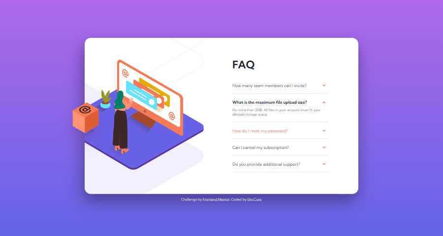

# Frontend Mentor - FAQ accordion card solution

This is a solution to the [FAQ accordion card challenge on Frontend Mentor](https://www.frontendmentor.io/challenges/faq-accordion-card-XlyjD0Oam).

## Table of contents

- [Overview](#overview)
  - [The challenge](#the-challenge)
  - [Screenshot](#screenshot)
  - [Links](#links)
- [My process](#my-process)
  - [Built with](#built-with)
  - [What I learned](#what-i-learned)
  - [Continued development](#continued-development)
  - [Useful resources](#useful-resources)
- [Author](#author)

## Overview

### The challenge

Users should be able to:

- View the optimal layout for the component depending on their device's screen size
- See hover states for all interactive elements on the page
- Hide/Show the answer to a question when the question is clicked

### Screenshot

### Links

- Live Site URL: [Live Site](https://gc11-faq-accordion.netlify.app/)

## My process

### Built with

- Semantic HTML5 markup
- CSS custom properties
- Flexbox
- Mobile-first workflow
- JavaScript

### What I learned

- The accordion:

  - How did I nest the hidden content?

    - The hidden content are siblings with question, the former's height/max-height being 0.

  - How did I reveal the content?

    - Via an addEventListener whose function on click is to change the max-height.

  - How did I animate the reveal?

    - For the answer itself, two ways:

      - The max-height transition
      - A keyframe that happens when the active class is added to the element.

    - For the arrow, I rotated it via transform.

  - How could I make this better?

    - By letting JavaScript calculate the content each content's height.

- Mobile layout:

  - The height of the card was not explicitly declared. The height depended the accordion section which changes depending on the number of items opened.

  - The width was similarly dependent on the width of the device itself. A margin to the sides were added to make sure that the card doesn't touch the edges of the screen.

  - How did I position the illustrations:

    - Nested in a picture tag, the images were absolutely positioned relative to a main image box.

    - Each illustration was given a z-index lower/higher than the other, because they overlap.

    - The image box was given an explicit width, to account for its children being absolutely positioned.

    - The image box was aligned to the center. This is key to keeping the illustrations centered even when the window is resized.

- Tablet/Desktop Layout

  - How did I deal with the box overflowing the card while the rest of the illustrations didn't?

    - I settled on having an outer and inner card section. Inside the outermost card, the box was a sibling to the inner card.

  - How did I make the layout responsive?

    - Instead of just making the card smaller, I made the width expandable/collapsible.

      - The imagebox was given a width. The accordion was given a max-width.

      - The main illustration was given a min-width and max-width. The latter was set to 100%. It then starts out small on tablet-sized devices before it gets big on desktop-sized ones.

      - As all of its children are absolutely positioned, the imagebox's width collapses even without setting a min or max-width.

      - The shadow illustration was left untouched because, on accident, I found that it becomes a nice background image for the accordion component on tablet-sized devices.

      - Via opacity, the box was triggered to show only once the illustration has reached its max width.

      - The box was intentionally left to move up and down according to how many questions were opened. I thought that looked cooler than if it was just static 😛

### Continued development

- It will be helpful if I did more accordion components, and absolutely positioned designs.

- I'd like to know how to automatically calculate each accordion item's max-height via JS, instead of doing it manually.

- I would like to try other methods to lay out the images. In making this, I had not thought about setting the woman illustration and its shadow as a background image. I know other people did that. I would like to know the advantages of that method.

- I definitely need more practice on using max and min.

### Useful resources

- [This video by Developer Empire](https://www.youtube.com/watch?v=4qnWreynXLU) which taught me how to make an accordion with basic transition animations!

- [This article by Abdulqudus Abubakre](https://dev.to/ibn_abubakre/responsive-css-width-2jnm) which enlightened me more on how max-width works!

## Author

- Frontend Mentor - [@GioCura](https://www.frontendmentor.io/profile/GioCura)

## Acknowledgments

Thanks to Zellene for always helping me check my projects' functionality on Apple devices and browsers. :)
